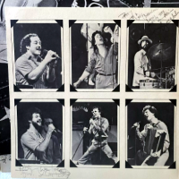

# XLayer

XLayer is a fully managed MP3 to WAV decoder. 

This repository is my port of [NLayer](https://github.com/naudio/NLayer) to modern .NET

Install with `dotnet add package XLayer`

Optimized for performance:

| Method | Mean     | Error   | StdDev  | Ratio | Gen0       | Gen1      | Allocated | Alloc Ratio |
|------- |---------:|--------:|--------:|------:|-----------:|----------:|----------:|------------:|
| NLayer | 514.5 ms | 3.51 ms | 3.28 ms |  1.00 | 26000.0000 | 1000.0000 | 484.66 MB |       1.000 |
| XLayer | 476.5 ms | 2.11 ms | 1.98 ms |  0.93 |          - |         - |   3.47 MB |       0.007 |

The NLayer code was originally based 
on [JavaLayer](http://www.javazoom.net/javalayer/javalayer.html) (v1.0.1), 
which has been ported to C#.

Was previously hosted at [NLayer.codeplex.com](http://NLayer.codeplex.com/). 
Please see the history there for full details of contributors.

## Usage

To use XLayer for decoding MP3, first reference XLayer.

```cs
using XLayer;
```

Then create an `MpegFile`, pass a file name or a stream to the constructor, and use `ReadSamples` for decoding the content:

```cs
// samples per second times channel count
const int samplesCount = 44100;
var fileName = "myMp3File.mp3";
var mpegFile = new MpegFile(fileName);
float[] samples = new float[samplesCount];
int readCount = mpegFile.ReadSamples(samples, 0, samplesCount);
```

More information could be found in code documents.

## Use with NAudio

I have not tested this port with NAudio

## Testing

XLayer.Tests project:
- `dotnet run` Will compare NLayer samples = XLayer samples
- `dotnet run -m` Helper that will run just XLayer for memory profiling
- `dotnet run -b` Run benchmarks against NLayer
- `dotnet run -p` Loop through ffmpeg pipe back to mp3 to validate audio quality

## Music 
Sample music is from my god-father's classic rock band [The Toons](https://www.discogs.com/artist/767082-The-Toons). 

  